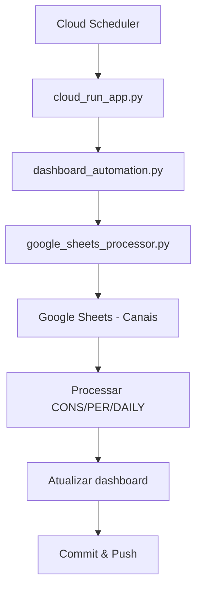
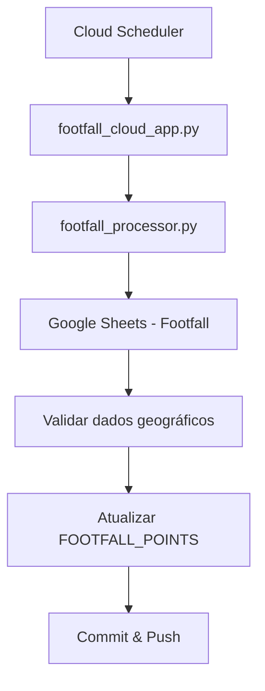

# 🗺️ Arquitetura Separada de Footfall

## 📋 Visão Geral

A nova arquitetura separa completamente o processamento de dados de **Canais** do processamento de dados de **Footfall**, resolvendo problemas de validação e conflitos de dados.

## 🏗️ Estrutura de Arquivos

```
├── dashboard_automation.py      # ✅ Processamento de canais (YouTube, TikTok, etc.)
├── cloud_run_app.py            # ✅ API Cloud Run para canais
├── footfall_processor.py       # 🆕 Processamento específico de footfall
├── footfall_cloud_app.py       # 🆕 API Cloud Run para footfall
├── footfall_config.py          # 🆕 Configurações específicas de footfall
└── google_sheets_processor.py  # ✅ Processamento base do Google Sheets
```

## 🔄 Fluxos Separados

### 1. **Atualização de Canais** (dashboard_automation.py)


### 2. **Atualização de Footfall** (footfall_processor.py)


## 🎯 Benefícios da Separação

### ✅ **Isolamento de Erros**
- Problema em canais não afeta footfall
- Problema em footfall não afeta canais
- Debugging mais fácil e específico

### ✅ **Validações Específicas**
- **Canais**: spend, impressions, clicks, VTR, CPV
- **Footfall**: lat/lon, users, rate, validações geográficas

### ✅ **Execução Independente**
- Canais: a cada 3 horas
- Footfall: a cada 6 horas (menos crítico)

### ✅ **Manutenção Simplificada**
- Código mais limpo e focado
- Responsabilidades bem definidas
- Testes isolados

## 🚀 Deploy dos Serviços

### 1. **Serviço de Canais** (existente)
```bash
gcloud run deploy dashboard-automation \
  --source . \
  --region=us-central1 \
  --platform=managed \
  --allow-unauthenticated
```

### 2. **Serviço de Footfall** (novo)
```bash
gcloud run deploy footfall-automation \
  --source . \
  --region=us-central1 \
  --platform=managed \
  --allow-unauthenticated
```

## ⏰ Agendamento

### **Cloud Scheduler - Canais**
```bash
gcloud scheduler jobs create http dashboard-automation-scheduler \
  --schedule="0 */3 * * *" \
  --uri="https://dashboard-automation-xxx.run.app/trigger" \
  --http-method=POST \
  --location=us-central1
```

### **Cloud Scheduler - Footfall**
```bash
gcloud scheduler jobs create http footfall-automation-scheduler \
  --schedule="0 */6 * * *" \
  --uri="https://footfall-automation-xxx.run.app/trigger" \
  --http-method=POST \
  --location=us-central1
```

## 🔧 Configurações

### **Configuração de Canais** (config.py)
```python
GOOGLE_SHEETS_CONFIG = {
    "YouTube": {...},
    "TikTok": {...},
    "Netflix": {...},
    # ...
}
```

### **Configuração de Footfall** (footfall_config.py)
```python
FOOTFALL_SHEETS_CONFIG = {
    "Footfall Data": {
        "sheet_id": "SEU_SHEET_ID_FOOTFALL",
        "gid": "SEU_GID_FOOTFALL",
        "columns": {
            "name": "Nome da Loja",
            "lat": "Latitude",
            "lon": "Longitude",
            "users": "Usuários Detectados",
            "rate": "Taxa de Conversão (%)"
        }
    }
}
```

## 📊 Endpoints das APIs

### **API de Canais** (dashboard-automation)
- `GET /health` - Health check
- `GET /status` - Status da automação
- `POST /trigger` - Disparar atualização
- `GET /logs` - Logs da automação
- `GET /config` - Configurações

### **API de Footfall** (footfall-automation)
- `GET /health` - Health check
- `GET /status` - Status da automação
- `POST /trigger` - Disparar atualização
- `GET /config` - Configurações de footfall
- `GET /test` - Testar conexão

## 🧪 Testes

### **Testar Canais**
```bash
curl -X POST https://dashboard-automation-xxx.run.app/trigger
curl https://dashboard-automation-xxx.run.app/status
```

### **Testar Footfall**
```bash
curl -X POST https://footfall-automation-xxx.run.app/trigger
curl https://footfall-automation-xxx.run.app/status
curl https://footfall-automation-xxx.run.app/test
```

## 🔄 Migração

1. **Manter serviço atual funcionando**
2. **Deploy do novo serviço de footfall**
3. **Testar serviços separadamente**
4. **Configurar Cloud Scheduler para footfall**
5. **Remover lógica de footfall do serviço de canais**
6. **Monitorar e ajustar conforme necessário**

## 📈 Monitoramento

### **Logs Separados**
- Canais: `dashboard-automation` logs
- Footfall: `footfall-automation` logs

### **Métricas Independentes**
- Taxa de sucesso por serviço
- Tempo de execução por serviço
- Erros específicos por contexto

## 🎉 Resultado Final

- ✅ **Código mais limpo e organizado**
- ✅ **Menos conflitos de dados**
- ✅ **Debugging mais fácil**
- ✅ **Manutenção simplificada**
- ✅ **Escalabilidade independente**
- ✅ **Monitoramento específico**
